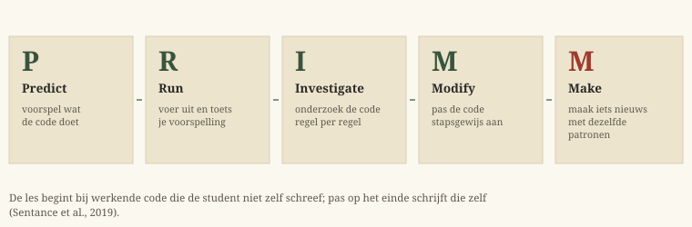

# Hoe leer je beginners effectief programmeren?

**Praktijkaanbevelingen voor docenten in het professioneel hoger onderwijs**

*Lars De Richter — Thomas More Hogeschool — juli 2026 — werkdocument,
samengesteld met AI-assistentie (zie de [noot over AI-gebruik en
licentie](#noot-over-ai-gebruik-en-licentie))*

Deze leidraad vormt een drieluik met de
[literatuurstudie](../literature-review-teaching-programming-beginners.md)
(de volledige evidentie) en de [reader](../reader/README.md) (de
sleutelpublicaties zelf, met leeswijzers). De leidraad is de kortste en
meest praktische van de drie: wie wil weten *waarom* een aanbeveling geldt,
vindt de onderbouwing in de literatuurstudie; wie de bronnen zelf wil
bestuderen, vindt ze in de reader.

## Inhoud

- [Voorwoord](#voorwoord)
- [Programmeren leren: what's in a name?](#programmeren-leren-whats-in-a-name)
- [Wat zegt het onderzoek?](#wat-zegt-het-onderzoek)
- [Aanbevelingen](#aanbevelingen)
  - [Voor je begint: vier uitgangspunten](#voor-je-begint-vier-uitgangspunten)
  - [Overzicht van de aanbevelingen](#overzicht-van-de-aanbevelingen)
  - [Aanbeveling 1: onderwijs begrip vóór productie](#aanbeveling-1-onderwijs-begrip-vóór-productie)
  - [Aanbeveling 2: scaffold stevig en bouw bewust af](#aanbeveling-2-scaffold-stevig-en-bouw-bewust-af)
  - [Aanbeveling 3: veel kleine oefeningen, directe feedback en één projectlijn](#aanbeveling-3-veel-kleine-oefeningen-directe-feedback-en-één-projectlijn)
  - [Aanbeveling 4: modelleer het denkproces, ook het debuggen](#aanbeveling-4-modelleer-het-denkproces-ook-het-debuggen)
  - [Aanbeveling 5: structureer samenwerking](#aanbeveling-5-structureer-samenwerking)
  - [Aanbeveling 6: ontwerp voor zelfvertrouwen en volg de eerste weken op](#aanbeveling-6-ontwerp-voor-zelfvertrouwen-en-volg-de-eerste-weken-op)
  - [Aanbeveling 7: voer een expliciet, gefaseerd AI-beleid](#aanbeveling-7-voer-een-expliciet-gefaseerd-ai-beleid)
- [Hoe is deze leidraad tot stand gekomen?](#hoe-is-deze-leidraad-tot-stand-gekomen)
- [Noot over AI-gebruik en licentie](#noot-over-ai-gebruik-en-licentie)
- [Referenties](#referenties)

## Voorwoord

Programmeren heeft de reputatie van struikelvak. Die reputatie is deels
terecht — wereldwijd faalt gemiddeld ongeveer een derde van de studenten in
een eerste programmeervak — maar het beeld van een uniek onhaalbaar vak
klopt niet: de cijfers zijn vergelijkbaar met die van andere veeleisende
STEM-vakken (Watson & Li, 2014). Belangrijker is wat de
interventieliteratuur laat zien: programma's die overschakelen op beter
onderbouwde didactiek verbeteren hun slaagcijfers met bijna een derde ten
opzichte van klassiek hoorcollege-onderwijs (Vihavainen et al., 2014).
Falen in het programmeeronderwijs is met andere woorden geen natuurwet en
geen talentfilter, maar in belangrijke mate een ontwerpprobleem — en
ontwerpproblemen kan je aanpakken.

Deze leidraad vertaalt vijf decennia onderzoek naar programmeeronderwijs in
zeven concrete aanbevelingen voor de lespraktijk. Ze is geschreven voor
docenten die beginners leren programmeren in het professioneel hoger
onderwijs — graduaat en professionele bachelor — en is daarnaast expliciet
bedoeld als lesmateriaal voor wie zelf leert lesgeven in programmeren. De
aanbevelingen zijn evidence-informed: ze steunen op de literatuurstudie in
deze repository en op de primaire studies uit de bijbehorende reader.

Vooraf schetst de leidraad kort wat programmeren leren zo lastig maakt en
wat het onderzoek daarover zegt: aanbevelingen zonder dat model blijven
recepten. Wie dieper wil graven, volgt de verwijzingen naar de
literatuurstudie (aangeduid als "literatuurstudie §n") en naar de reader.

Doorheen de tekst duiken drie soorten kaders op:

- **Definitie** — een kernbegrip, kort uitgelegd.
- **Verdieping** — achtergrond bij een claim of mechanisme.
- **Werkvorm** — een concrete aanpak die je morgen kan uitproberen.

## Programmeren leren: what's in a name?

### Waarom programmeren leren moeilijk is

De folklore zegt: syntax. Het onderzoek zegt al veertig jaar iets anders.
De klassieke studies vonden dat de meeste fouten van beginners niet
voortkomen uit misverstanden over taalconstructies, maar uit het niet
kunnen samenstellen van deelplannen tot een werkend geheel (literatuurstudie
§2.1). De echte moeilijkheid zit dieper: een beginner moet tegelijk een
notatie leren, een probleem analyseren, gereedschap bedienen én — het
fundament onder dat alles — een mentaal model opbouwen van wat de computer
met code *doet* (du Boulay, 1986). Al die moeilijkheden komen bovendien
tegelijk binnen, wat het werkgeheugen van een beginner ver overvraagt
(Hermans, 2021; Sweller et al., 2019).

> **Definitie — notional machine.** De notional machine is het
> geïdealiseerde model van de computer zoals de programmeertaal die
> voorstelt: wat gebeurt er bij een toewijzing, hoe loopt een lus, waar
> "staat" een variabele? Beginners hebben, anders dan bij fysica of
> rekenen, geen bruikbaar voorafgaand model van een computer om op verder
> te bouwen; het model moet dus expliciet onderwezen worden (Ben-Ari,
> 1998; Sorva, 2013). Veel klassieke misvattingen — een variabele die
> "meerdere waarden onthoudt", een toewijzing die als vergelijking werkt —
> zijn goed te begrijpen als haperende notional machines.

### Lezen komt vóór schrijven

Het meest praktijkrelevante resultaat uit het vakgebied: begrip en
productie zijn verschillende vaardigheden, en klaslokalen keren de volgorde
vaak om. Een multinationale studie liet zien dat studenten na een eerste
programmeervak veel slechter programmeerden dan hun docenten verwachtten
(McCracken et al., 2001); het vervolgonderzoek vond een basaler probleem:
veel studenten konden bestaande code niet eens betrouwbaar lezen en
traceren (Lister et al., 2004). Latere studies bevestigden dat traceren en
uitleggen samenhangen met kunnen schrijven, en dat wie een codefragment in
één zin kan samenvatten meestal ook kan programmeren (Murphy et al., 2012).
De strikte volgorde-interpretatie is genuanceerd — meerdere
vaardigheidsstructuren passen even goed op de data (Fowler et al., 2022) —
maar de kern staat: begrip is apart leerbaar en toetsbaar, en verdient een
expliciete plaats vóór en naast het schrijven.

Xie et al. (2019) werkten dit uit tot een instructietheorie met vier
deelvaardigheden, die je expliciet en in volgorde onderwijst en toetst
(figuur 1). Dit "comprehension-first"-model is momenteel het dichtste wat
het vakgebied bij een consensusmodel heeft (literatuurstudie §3.5) — en het
is ook het model dat de komst van generatieve AI het best overleeft.

### De mythe van het programmeergen

Een hardnekkige overtuiging wil dat programmeertalent aangeboren is: een
deel van de studenten "heeft het" en de rest leert het nooit. De empirische
basis daarvoor is ingestort. De beruchte aptitude-paper "the camel has two
humps" werd nooit peer-reviewed en is door de auteur formeel ingetrokken
(Bornat, 2014). Patitsas et al. (2020) analyseerden 778 puntenverdelingen
en vonden er slechts 5,8% multimodaal — en docenten die in aangeboren
talent geloofden, zagen vaker bimodaliteit in dubbelzinnige histogrammen.
De spreiding in resultaten heeft een betere verklaring: *learning edge
momentum* (Robins, 2010). Omdat programmeerconcepten ongewoon sterk op
elkaar voortbouwen, stapelt vroeg succes zich op — en vroege achterstand
ook. Dat is een volgorde- en ondersteuningseffect, geen gen. Deze mythe is
niet onschuldig: docenten die erin geloven geven anders les, en studenten
die ze oppikken haken af (literatuurstudie §2.6, §7.2).

### De beginner in het graduaat

Het meeste onderzoek gebeurt bij bachelorstudenten aan
onderzoeksuniversiteiten; de graduaatspopulatie is ondervertegenwoordigd
in de literatuur (Lyon & Denner, 2016; literatuurstudie §8.1). Wat we wel
weten: motivatie is er directer beroepsgericht, eerdere schoolse
tegenslagen en wiskundeangst komen vaker voor, en externe factoren — werk,
gezin, financiën — wegen minstens zo zwaar op doorzetten als de
moeilijkheid van het vak. Niets daarvan wijst op lagere plafonds; het
betekent wel dat de aanbevelingen hieronder voor deze populatie eerder
zwaarder dan lichter wegen, in het bijzonder de scaffolding (aanbeveling
2), de contextualisering (uitgangspunt 2) en het affectieve ontwerp
(aanbeveling 6).

## Wat zegt het onderzoek?

Vier bevindingen dragen alles wat volgt.

**Uitval is reëel, maar beïnvloedbaar.** De gemiddelde faalcijfers (rond
een derde) zijn stabiel over talen en jaren heen (Watson & Li, 2014), maar
reageren sterk op didactiek: beter onderbouwde aanpakken verhogen
slaagcijfers met bijna een derde (Vihavainen et al., 2014). De docent doet
ertoe, veel meer dan de taalkeuze.

**Begrip gaat vooraf aan productie.** Lezen, traceren en uitleggen van code
zijn aparte, leerbare, toetsbare vaardigheden die het schrijven
onderbouwen (Lister et al., 2004; Xie et al., 2019). Onderwijs dat meteen
laat schrijven zonder begrip te onderwijzen, produceert precies de
teleurstellende resultaten van McCracken et al. (2001).

**Sturing werkt, zeker in het begin.** Voor beginners in een complex domein
verslaat expliciete, sterk gestructureerde instructie minimaal begeleide
ontdekking — programmeren is daarvoor zowat het schoolvoorbeeld (Kirschner
et al., 2006). De best gemeten klasresultaten komen van zwaar gescaffolde
ontwerpen, waarbij de ondersteuning geleidelijk afgebouwd wordt (Sweller et
al., 2019; literatuurstudie §3.1, §4.1–4.3).

**Generatieve AI verschuift de accenten, niet de fundamenten.** Sinds
LLM's de meeste klassieke beginnersopdrachten foutloos oplossen
(Finnie-Ansley et al., 2022), is onbewaakt code schrijven als toets
onbruikbaar geworden en is *oordelen over code* — lezen, evalueren,
specificeren, testen — nog belangrijker dan het al was (Denny et al.,
2024a). Voor zwakkere beginners is onbegeleide AI-toegang een gedocumenteerd
risico (Prather et al., 2024a). Aanbeveling 7 werkt dit uit.

## Aanbevelingen

### Voor je begint: vier uitgangspunten

De zeven aanbevelingen staan of vallen met een aantal uitgangspunten die
aan het vak-ontwerp voorafgaan.

**1. Behandel programmeren als leerbaar — en gedraag je ernaar.**
Geen talent-retoriek, geen curve-quotering, geen "wie het niet snapt zit
hier verkeerd". Die signalen leren studenten dat vermogen vaststaat, en
laten precies de studenten los die de opleiding wil binnenhouden (Patitsas
et al., 2020; literatuurstudie §4.10, §7.2). Wat wél werkt, staat in
aanbeveling 6.

**2. Contextualiseer in het doelberoep.** Betekenis stuurt volharding. De
best gedocumenteerde casus is media computation — programmeren leren via
beeld en geluid — die de uitval van niet-informatici drastisch verlaagde
bij vergelijkbare leerresultaten (Guzdial, 2013). De les is niet
"gebruik multimedia" maar: kies een context die jouw studenten waardevol
vinden en houd eraan vast. Voor een webgericht graduaat betekent dat:
oefeningen die zichtbaar tot het beroep behoren (websites, API's, data),
geen abstracte puzzels.

**3. Kies taal en tools pragmatisch, en onderwijs het machinemodel van je
keuze expliciet.** Slaagcijfers verschillen niet significant per taal
(Watson & Li, 2014); onvriendelijke syntax kost wel meetbaar extra
cognitieve belasting (Stefik & Siebert, 2013). Elke taalkeuze koopt haar
eigen misvattingsrisico's — de aanbeveling is dus niet dé ideale taal
zoeken, maar bewust kiezen en vervolgens de notional machine van die taal
expliciet onderwijzen (Sorva, 2013). Beperk incidentele complexiteit in de
eerste weken (één klik om te runnen, zichtbare programmatoestand, geen
build-systemen) en voer professionele tooling later in als leerstof, niet
als verondersteld voorwerk (literatuurstudie §5.3).

**4. Bouw op twee ruggengraten.** Praktijkgerichte opleidingen ontwerpen
hun curriculum het best rond twee sporen tegelijk: een lijn van hele,
authentieke taken van stijgende complexiteit (het projectspoor), en een
lijn van bewust geplande deeloefening en begripswerk (het oefenspoor). Dat
is de kern van four-component instructional design (4C/ID), het dominante
ontwerpmodel in het Nederlandstalige professioneel hoger onderwijs (van
Merriënboer & Kirschner, 2018). De twee klassieke ontsporingen zijn elk
één spoor schrappen: "projecten vanaf dag één" overbelast zwakkere
studenten en reproduceert het McCracken-probleem; "eindeloos oefeningen
maken" demotiveert precies de beroepsgerichte populatie (literatuurstudie
§8.2).

### Overzicht van de aanbevelingen

| # | Aanbeveling | Kern |
|---|-------------|------|
| 1 | Begrip vóór productie | Onderwijs en toets lezen, traceren en uitleggen expliciet; werk PRIMM-gewijs. |
| 2 | Scaffold stevig, bouw af | Uitgewerkte voorbeelden → Parsons → aanvullen → zelf schrijven. |
| 3 | Klein oefenen, snel feedback | Veel kleine opgaven met directe feedback, naast één groeiende projectlijn. |
| 4 | Modelleer het denkproces | Live coding met fouten; debuggen en probleemaanpak als leerstof. |
| 5 | Structureer samenwerking | Pair programming met protocol; peer instruction voor conceptlessen. |
| 6 | Ontwerp voor zelfvertrouwen | Vroege successen, herstelbare mislukking; volg weken 2–6 actief op. |
| 7 | Gefaseerd AI-beleid | Beschermde kern, begeleide hulp, AI-toegelaten werk — expliciet en toetsbaar. |

### Aanbeveling 1: onderwijs begrip vóór productie

- Onderwijs code lezen, traceren en uitleggen als aparte vaardigheden, vóór
  en naast het schrijven.
- Structureer lessen volgens een PRIMM-achtige cyclus: start bij werkende
  code die de student niet zelf schreef.
- Maak de notional machine zichtbaar: traceerprotocollen,
  geheugendiagrammen, visualisatietools.
- Behandel foutmeldingen lezen als benoemde leerstof.
- Toets begrip expliciet: traceer-, verklaar- en verbeteritems horen in
  elke toets, niet alleen schrijfopdrachten.

De vaardigheidstrap van figuur 1 is direct om te zetten in lesontwerp:
laat studenten eerst voorspellen en traceren wat code doet, dan bestaande
code verklaren en aanpassen, en pas daarna zelf schrijven. Het
PRIMM-raamwerk operationaliseert dit voor een les of lessenreeks (figuur
2). Twee ontwerpprincipes doen er het zware werk: studenten beginnen bij
*werkende code die ze niet zelf schreven* — dat verlaagt de belasting én
depersonaliseert fouten — en het klasgesprek wordt gestructureerd rond die
code (Sentance et al., 2019). De gecontroleerde evaluatie komt uit het
secundair onderwijs, maar de onderliggende mechanismen zijn
leeftijdsonafhankelijk en het raamwerk wordt breed toegepast in het hoger
onderwijs (literatuurstudie §4.5).

> **Werkvorm — de geheugentabel.** Geef studenten een vast papieren
> traceerprotocol: een tabel met één kolom per variabele en één rij per
> uitgevoerde regel. Laat ze bij elke lus-iteratie de toestand invullen en
> de uitvoer voorspellen vóór ze het programma runnen. Traceervaardigheid
> hangt samen met schrijfvaardigheid (Lister et al., 2004), en een
> visualisatietool zoals Python Tutor helpt vooral wanneer studenten
> actief voorspellen in plaats van passief kijken (literatuurstudie
> §4.8).

Foutmeldingen verdienen een eigen les. Ze zijn een gedocumenteerd
struikelblok voor beginners (Becker et al., 2019); leer studenten expliciet
hoe ze een foutmelding ontleden (welke regel, welke soort, wat is de
hypothese?) in plaats van te veronderstellen dat dit vanzelf komt.

Sluit ten slotte de toetsing aan op de trap: een evenwichtige toets bevat
traceeritems, verklaar-in-één-zin-items ("explain in plain English"),
Parsons-items en verbeteropdrachten naast schrijfopdrachten
(literatuurstudie §6.2). Zo kunnen studenten met gedeeltelijke beheersing
die ook tonen — wat, gezien het momentum-effect (Robins, 2010), het
verschil kan maken tussen bijbenen en afhaken.

### Aanbeveling 2: scaffold stevig en bouw bewust af

- Begin elk nieuw onderwerp met uitgewerkte voorbeelden, voorzien van
  subgoal labels.
- Gebruik Parsons-opgaven als tussenstap tussen bestuderen en zelf
  schrijven.
- Bouw de ondersteuning per onderwerp af: voorbeeld → Parsons → aanvullen →
  zelf schrijven.
- Verwacht geen ontdekkend leren van beginners; bewaar open opdrachten
  voor wie de basis beheerst.

Voor beginners in een complex domein is minimaal begeleide ontdekking een
slecht startpunt: het werkgeheugen loopt over voor er iets geleerd wordt
(Kirschner et al., 2006; Sweller et al., 2019). Het best gemeten
alternatief begint bij *uitgewerkte voorbeelden*: volledige, geannoteerde
oplossingen die de student bestudeert vóór die zelf produceert. Voeg
subgoal labels toe — korte functionele namen bij de stappen van het
voorbeeld ("lees invoer in", "initialiseer teller", "werk teller bij") —
zodat de onderliggende planstructuur expliciet en overdraagbaar wordt.
Toen zulk materiaal een volledig semester lang werd ingezet, verbeterden de
resultaten, daalde de spreiding en vielen minder studenten uit — met de
grootste winst bij studenten met het hoogste risico op falen (Margulieux
et al., 2020).

> **Definitie — Parsons-opgave.** Een Parsons-opgave geeft de student een
> correcte oplossing, in stukken geknipt en door elkaar gehusseld, soms
> met afleiders. De student sleept de regels in de juiste volgorde. Zo
> wordt algoritme-opbouw geïsoleerd van syntax-recall en typwerk (Parsons
> & Haden, 2006). Het effect is goed onderzocht: vergelijkbare leerwinst
> als het equivalente programma zelf schrijven, in beduidend minder tijd
> en met lagere cognitieve belasting (Ericson et al., 2022). De gewonnen
> tijd herinvesteer je in méér en gevarieerdere oefening.

Cruciaal is de afbouw (figuur 3). Ondersteuning die beginners helpt, wordt
overbodig of zelfs hinderlijk zodra competentie groeit — het expertise
reversal effect (Sweller et al., 2019). De praktische sequens per
onderwerp: eerst een uitgewerkt voorbeeld, dan een variant bestuderen of
ordenen (Parsons), dan een gedeeltelijke oplossing aanvullen, dan pas een
volledig zelf geschreven oplossing. Die reeks past naadloos op PRIMM en op
Use-Modify-Create, de grovere curriculumvariant (Lee et al., 2011).

### Aanbeveling 3: veel kleine oefeningen, directe feedback en één projectlijn

- Vervang enkele grote opdrachten door veel kleine opgaven met
  onmiddellijke feedback en een beheersingsdrempel.
- Schrijf de feedback van je autograder als lesmateriaal, niet als
  foutmelding.
- Combineer geautomatiseerde feedback met menselijke feedbackmomenten.
- Laat naast het oefenspoor één authentiek project meegroeien doorheen het
  semester.

Regimes met veel kleine, direct verbeterde oefeningen horen bij de best
onderbouwde vak-transformaties (Vihavainen et al., 2014); "many small
programs" in plaats van één groot programma gaf gelijke of betere
resultaten met minder stress (Allen et al., 2018), en gespreid, afgewisseld
oefenen is een van de best onderbouwde principes uit de algemene
leerwetenschap (Dunlosky et al., 2013).

Geautomatiseerde beoordeling maakt dit schaalbaar, maar de leerwaarde hangt
volledig af van wat de feedback zégt. De systematische review van Keuning
et al. (2018) vond dat de meeste tools vooral melden *dat* iets fout is
(geslaagde en gefaalde tests) en veel minder *hoe het verder moet* — hints,
volgende stappen, foutlokalisatie. Drie praktische gevolgen: schrijf
testfeedback als onderwijstekst ("je lus stopt één element te vroeg;
controleer je grens" in plaats van "assertion failed"); plan menselijke
feedbackmomenten naast de autograder (codereview in het labo); en bewaak
het bekende risico dat studenten tegen de grader gaan "schieten" in plaats
van redeneren — inzendlimieten of reflectievragen temperen dat
(literatuurstudie §6.1).

> **Verdieping — beheersing en tempo.** Omdat programmeerkennis ongewoon
> sequentieel is, verslaan structuren die hiaten dwingen te sluiten
> (herkansbare beheersingstoetsen, gateway-testen van basisvloeiendheid)
> structuren die tekorten stil laten opstapelen; de winst concentreert
> zich bij zwakkere studenten (McCane et al., 2017). De gedocumenteerde
> valkuil is uitstelgedrag wanneer deadlines wegvallen — koppel
> beheersingsstructuren dus aan een duidelijk tempo-schema (Ott et al.,
> 2021).

Pure drill heeft een grens: wie alleen kleine opgaven maakt, leert
constructies zonder plannen. Het oefenspoor heeft daarom de projectlijn
van uitgangspunt 4 naast zich nodig: één authentieke opdracht die
doorheen het semester meegroeit en waarin decompositie, integratie en
betekenis aan bod komen (literatuurstudie §4.3, §8.2).

### Aanbeveling 4: modelleer het denkproces, ook het debuggen

- Programmeer live voor de klas: traag, hardop denkend, met fouten.
- Las voorspelmomenten in tijdens het live coden.
- Onderwijs een expliciete probleemaanpak (begrijpen → plannen →
  uitvoeren → evalueren) en benoem de fasen in de les.
- Onderwijs systematisch debuggen als leerstof, niet als bijvangst.

Experts maken hun denken onzichtbaar; goed onderwijs maakt het weer
zichtbaar. Live coding — code schrijven waar studenten bij zijn, inclusief
vergissingen en het herstel ervan — is minstens zo effectief als statische
voorbeelden (Rubin, 2013) en kwalitatief beter in het aanleren van
*proces*: incrementeel werken, testgedrag, en de normaliteit van fouten
(Raj et al., 2018). De empirische aandachtspunten: het tempo ligt snel te
hoog en studenten hebben steun nodig bij het noteren (Shah et al., 2023).

> **Werkvorm — live coding met voorspelmomenten.** Vier afspraken maken
> live coding didactisch: (1) benoem je bedoeling vóór je typt; (2) maak
> bewust de typische beginnersfout en herstel ze hardop; (3) stop op
> beslispunten en laat de klas voorspellen wat er gebeurt — een
> micro-PRIMM binnen het college; (4) deel achteraf de eindversie van de
> code, zodat noteren het meedenken niet verdringt.

Twee expertvaardigheden worden zo routineus verondersteld dat vakken
vergeten ze te onderwijzen. De eerste is procesbewaking: beginners weten
vaak niet *waar ze zijn* in hun probleemoplossing — ze slaan de
interpretatie van het probleem over, springen naar code en kijken niet
meer om (Prather et al., 2018). Een expliciet fasenmodel aanleren en
studenten hun huidige fase laten benoemen, verbeterde zowel het
zelfinzicht als de prestaties (Loksa et al., 2016). De tweede is
debuggen: beginners debuggen kwalitatief anders dan experts — één vaste
hypothese, lukrake aanpassingen (McCauley et al., 2008). Een systematisch
debugproces expliciet aanleren verbeterde in een gecontroleerde
klasstudie zowel de debugprestaties als de self-efficacy (Michaeli &
Romeike, 2019). Beide thema's zijn urgenter geworden in het AI-tijdperk:
het gedocumenteerde faalpatroon van zwakkere studenten met AI-assistenten
is precies metacognitief (aanbeveling 7).

### Aanbeveling 5: structureer samenwerking

- Zet pair programming in met een aangeleerd protocol: rollen, rolwissels,
  en paren van vergelijkbaar niveau.
- Gebruik peer instruction voor conceptzware lessen.
- Vermijd ongestructureerd groepswerk in het eerste semester.

Samenwerken rond code werkt, maar alleen gestructureerd. *Pair
programming* — twee studenten, één toetsenbord, afwisselend bestuurder en
navigator — heeft meta-analytische steun: positieve effecten op
opdrachten, examens en doorstroom (Umapathy & Ritzhaupt, 2017), met de
winst geconcentreerd bij minder ervaren studenten en zonder nadeel voor
individuele examenprestaties (McDowell et al., 2006). De uitvoering
bepaalt het resultaat: wissel rollen verplicht en frequent, vorm paren van
vergelijkbaar (niet identiek) niveau, en onderwijs het protocol expliciet —
onverenigbare of meeliftende paren zijn de gedocumenteerde faalwijze.

> **Werkvorm — peer instruction in vijf stappen.** (1) Studenten bereiden
> de leerstof kort voor. (2) In de les krijgt de klas een conceptvraag
> (meerkeuze, gericht op een bekende misvatting) en stemt individueel.
> (3) Studenten overleggen in kleine groepen en verdedigen hun keuze.
> (4) De klas stemt opnieuw. (5) De docent bespreekt de redeneringen, niet
> alleen het juiste antwoord (Crouch & Mazur, 2001). Quoteer op deelname,
> niet op juistheid; de discussietijd is het werkzame bestanddeel. In
> vier informatica-vakken halveerde deze aanpak de faalcijfers, gemeten
> bij dezelfde docenten (Porter et al., 2013).

De twee werkvormen delen één mechanisme dat het benoemen waard is: ze
*dwingen articulatie af*. Praten over code — een plan benoemen, een
voorspelling verdedigen — is precies de verklaar-vaardigheid die volgens
aanbeveling 1 de schakel vormt tussen lezen en schrijven. Ongestructureerd
groepswerk in semester één mist dat mechanisme: zonder aangeleerde
samenwerkingsprotocollen leert het vooral taakverdeling, geen
programmeren (literatuurstudie §4.10).

### Aanbeveling 6: ontwerp voor zelfvertrouwen en volg de eerste weken op

- Ontwerp voor vroege, echte succeservaringen en herstelbare mislukking
  (herkansingen, geen curve).
- Verwijder signalen die vaste aanleg suggereren; normaliseer worstelen
  expliciet.
- Gebruik vroege formatieve data (weken 2–6) om structurele ondersteuning
  te starten — geen labels.
- Neutraliseer de zichtbare voorsprong van studenten met eerdere
  programmeerervaring.

Self-efficacy — het geloof van een student in de eigen capaciteit om te
programmeren — voorspelt de resultaten sterker dan de meeste cognitieve
achtergrondvariabelen (Ramalingam et al., 2004); in het best gevalideerde
vroegvoorspellingsmodel voor programmeervakken is het de dominante factor
(Quille & Bergin, 2019). Ze is bovendien dynamisch: ze wordt gebouwd of
gesloopt door de textuur van vroege ervaringen. Kinnunen en Simon (2012)
documenteerden hoe doodgewone programmeeropdrachten het zelfvertrouwen van
eerstejaars uithollen op manieren die docenten nooit te zien krijgen. Veel
kleine vroege successen (aanbeveling 3), taken die studenten effectief
afwerken (aanbeveling 2) en foutmeldingen die niet vernederen (aanbeveling
1) zijn dus ook affectieve interventies, of je ze zo noemt of niet.

Koop geen mindset-programma; de meta-analyses van losse
mindset-interventies tonen erg kleine gemiddelde effecten (Sisk et al.,
2018). Verwijder in de plaats daarvan de signalen die vaste aanleg
aanleren — talent-retoriek, curve-quotering, publieke vroege rangordes —
en laat het vak zich gedragen naar de boodschap: herkansingen bestaan,
vroege mislukking is herstelbaar (Patitsas et al., 2020; literatuurstudie
§7.2). Let daarnaast op de klassamenstelling: eerdere
programmeerervaring creëert in week één een zichtbare hiërarchie die
stelselmatig als talent wordt misgelezen; contexten die voor iedereen
nieuw zijn, neutraliseren die voorsprong (literatuurstudie §7.3).

> **Verdieping — waarom weken 2–6 het venster zijn.** Learning edge
> momentum (Robins, 2010) voorspelt dat vroege hiaten zich razendsnel
> opstapelen in een vak waarin elk concept op het vorige bouwt. Het
> hefboommoment ligt dus vroeg: gevalideerde vroege voorspellers en
> formatieve gegevens uit de eerste weken kunnen risicostudenten met
> bruikbare nauwkeurigheid signaleren (Quille & Bergin, 2019). Cruciaal:
> voorspelling zonder gekoppeld ondersteuningsaanbod produceert alleen
> zelfvervullende labels. Het interventiebewijs wijst naar structurele
> steun — extra begeleide oefenmomenten, peer-structuren,
> beheersingstoetsen met herkansing — niet naar aansporing (Vihavainen et
> al., 2014).

### Aanbeveling 7: voer een expliciet, gefaseerd AI-beleid

- Verdeel het curriculum in drie expliciete zones: een beschermde kern
  zonder AI, begeleide AI-hulp, en AI-toegelaten authentiek werk.
- Behoud een beschermde vloeiendheidskern met toetsing onder
  gecontroleerde omstandigheden.
- Maak het ontwikkelproces zichtbaar en beoordeelbaar: commits,
  toelichtingen, mondelinge verdediging van eigen code.
- Onderwijs AI-geletterdheid als leerstof; reken niet op detectietools.
- Herzie het beleid jaarlijks: de evidentie is jong en de tools veranderen
  sneller dan de onderzoekscyclus.

Sinds code-genererende LLM's beter scoren dan de mediaan-student op
klassieke examens (Finnie-Ansley et al., 2022) meet een onbewaakte
schrijfopdracht hoogstens nog de bereidheid om een vrij beschikbare tool
niet te gebruiken (Denny et al., 2024a; Prather et al., 2023). Verbieden
bleek onhandhaafbaar en
strijdig met de beroepspraktijk; de posities in het veld zijn geconvergeerd
op integratie mét vangrails (Lau & Guo, 2023).

De risico's voor beginners zijn ondertussen gedocumenteerd, niet
speculatief. In observatie- en eye-trackingonderzoek gebruikten goed
voorbereide studenten AI om te versnellen, terwijl worstelende studenten
door AI-suggesties bleven klikken zonder begrip, *dachten dat ze
vorderden*, en eindigden met een opgeblazen zelfbeeld — een "widening gap"
tussen beide groepen (Prather et al., 2024a). Studenten met lagere
self-efficacy en meer faalangst gebruikten LLM's bovendien minder
productief (Margulieux et al., 2024): de affectieve factoren van
aanbeveling 6 modereren dus ook het AI-gebruik. Het risico is evenwel
conditioneel: bij jonge beginners verbeterde *gescaffolde* toegang tot een
codegenerator de taakprestaties zonder de latere handmatige prestaties te
schaden (Kazemitabaar et al., 2023). Alles hangt af van de begeleiding.

Daar staan even concrete kansen tegenover. AI-tutoren met vangrails — die
uitleggen, hints geven en vragen stellen maar geen volledige oplossingen
uitschrijven — zijn op vak-schaal ingezet met overwegend positieve
resultaten; studenten waarderen vooral de niet-oordelende hulp op momenten
dat menselijke begeleiding onbeschikbaar is (Kazemitabaar et al., 2024;
Liffiton et al., 2024; Liu et al., 2024). LLM's verbeteren aantoonbaar de
begrijpelijkheid van foutmeldingen (Leinonen et al., 2023) en genereren
tegen lage kost oefenmateriaal dat na menselijke controle bruikbaar is
(literatuurstudie §9.3) — een directe versterking van aanbeveling 3.

Het beleid dat uit de literatuur naar voren komt, verdeelt het curriculum
in drie zones (figuur 4). Zone één is de beschermde kern: zelfs de meest
integratiegezinde herontwerpen behouden een gecontroleerde demonstratie
dat de student zonder hulp basale code kan lezen, traceren en schrijven —
net omdat het beoordelen van AI-uitvoer precies die vloeiendheid
veronderstelt (Denny et al., 2024a; Vadaparty et al., 2024). Zone twee is
begeleide hulp via een AI-tutor met vangrails. Zone drie is authentiek
werk waarin AI toegelaten is zoals in het beroep, met vermelding van het
gebruik en beoordeling van het *proces* — commits, reflecties, en de
mondelinge verdediging van eigen code. Vertrouw daarbij niet op
detectietools: AI-detectoren zijn onbetrouwbaar voor code en aantoonbaar
bevooroordeeld tegen niet-moedertaalsprekers van het Engels (Liang et al.,
2023). Heldere afspraken plus authentieke AI-toegelaten opdrachten
beperken overtredingen beter dan een detectiewedloop (literatuurstudie
§9.5).

> **Werkvorm — Prompt Problems.** Draai de opdracht om: de student krijgt
> een visuele of gedragsspecificatie en moet een prompt construeren die
> een LLM correcte code laat genereren, inclusief het controleren van het
> resultaat. Dat oefent exact de vaardigheden die het vakgebied al
> waardeerde — precies specificeren en uitvoer evalueren (Denny et al.,
> 2024b).

Eén kanttekening hoort bij deze aanbeveling: de langetermijneffecten van
AI-geïntegreerd beginnersonderwijs worden pas sinds kort gemeten, en voor
de graduaatspopulatie is dit nagenoeg onbestudeerd terrein
(literatuurstudie §9.6). Formuleer je AI-beleid dus expliciet als
voorlopig, en herbekijk het jaarlijks.

## Hoe is deze leidraad tot stand gekomen?

Deze leidraad is het derde luik van een drieluik. Het eerste luik is een
narratieve literatuurstudie naar het onderwijzen van programmeren aan
beginners in het tertiair onderwijs
([literature-review-teaching-programming-beginners.md](../literature-review-teaching-programming-beginners.md)),
die de evidentie synthetiseert en per claim de sterkte kalibreert. Het
tweede luik is een reader ([reader/](../reader/)) met eenentwintig
sleutelpublicaties uit het vakgebied, integraal gelezen en van
leeswijzers voorzien. Deze leidraad condenseert beide tot
praktijkaanbevelingen; de tien aanbevelingen uit §11 van de
literatuurstudie zijn er geclusterd tot de zeven aanbevelingen hierboven.

Bij het schrijven zijn de dragende claims van elke aanbeveling waar
mogelijk geverifieerd tegen de primaire bronnen uit de reader (onder meer
de PRIMM-fasen, de vier deelvaardigheden van Xie et al., de
multimodaliteitscijfers van Patitsas et al., de widening-gap-bevindingen
van Prather et al. en de feedbackbevindingen van Keuning et al.). Claims
waarvoor de primaire bron niet in de reader zit — onder meer het onderzoek
naar live coding, pair programming en foutmeldingen — steunen op de
literatuurstudie; verifieer die tegen de originele publicatie vóór gebruik
in formeel academisch werk.

Drie methodologische kanttekeningen. Ten eerste is de onderliggende studie
narratief, geen systematische review: ze synthetiseert de hoofdlijnen en
gebruikt bestaande systematische reviews en meta-analyses als ankers, maar
catalogiseert niet uitputtend. Ten tweede is de evidentie zelden gemeten
op graduaatspopulaties; verschillende aanbevelingen zijn voor die context
theoriegedreven extrapolaties (literatuurstudie §8.1, §12). Ten derde
veroudert het AI-hoofdstuk snel: de tools veranderen sneller dan de
onderzoekscyclus, en aanbeveling 7 moet gelezen worden met de datum van
dit document ernaast.

## Noot over AI-gebruik en licentie

**Over het gebruik van AI.** Deze leidraad werd samengesteld met
substantiële AI-assistentie (Claude Fable 5, Anthropic). De selectie en
clustering van de aanbevelingen steunt op de literatuurstudie in deze
repository — zelf een werkdocument dat met AI-assistentie werd
samengesteld; de tekst werd met AI-ondersteuning
opgesteld en redactioneel bewerkt voor gebruik in het onderwijs. Omdat de
tekst originele studies samenvat en interpreteert, geldt: verifieer elke
claim tegen de originele publicatie vóór je ze citeert in formeel
academisch werk.

**Licentie.** Het originele materiaal in dit document — de tekst, de
structuur en de figuren — wordt door Lars De Richter vrijgegeven onder
[CC BY-NC-SA 4.0](https://creativecommons.org/licenses/by-nc-sa/4.0/deed.nl)
(Naamsvermelding – NietCommercieel – GelijkDelen). De geciteerde
publicaties vallen niet onder die licentie; elk blijft onder het
auteursrecht van de eigen auteurs en uitgevers.

## Referenties

*Vormnota: APA 7. Paginabereiken en DOI's die niet geverifieerd konden
worden, zijn weggelaten, conform de referentielijst van de
literatuurstudie. Vul ze aan vanuit de ACM Digital Library of de uitgever
vóór formeel gebruik.*

Allen, J. M., Vahid, F., Downey, K., & Edgcomb, A. D. (2018). Weekly
programs in a CS1 class: Experiences with auto-graded many-small programs
(MSP). In *Proceedings of the 49th ACM Technical Symposium on Computer
Science Education (SIGCSE '18)*. ACM.

Becker, B. A., Denny, P., Pettit, R., Bouchard, D., Bouvier, D. J.,
Harrington, B., Kamil, A., Karkare, A., McDonald, C., Osera, P.-M., Pearce,
J. L., & Prather, J. (2019). Compiler error messages considered unhelpful:
The landscape of text-based programming error message research. In
*Proceedings of the Working Group Reports on Innovation and Technology in
Computer Science Education (ITiCSE-WGR '19)*. ACM.
https://doi.org/10.1145/3344429.3372508

Ben-Ari, M. (1998). Constructivism in computer science education. *ACM
SIGCSE Bulletin, 30*(1), 257–261. https://doi.org/10.1145/274790.274308

Bornat, R. (2014). *Camels and humps: A retraction*. School of Science and
Technology, Middlesex University.

Crouch, C. H., & Mazur, E. (2001). Peer instruction: Ten years of experience
and results. *American Journal of Physics, 69*(9), 970–977.
https://doi.org/10.1119/1.1374249

Denny, P., Prather, J., Becker, B. A., Finnie-Ansley, J., Hellas, A.,
Leinonen, J., Luxton-Reilly, A., Reeves, B. N., Santos, E. A., & Sarsa, S.
(2024a). Computing education in the era of generative AI. *Communications of
the ACM, 67*(2), 56–67. https://doi.org/10.1145/3624720

Denny, P., Leinonen, J., Prather, J., Luxton-Reilly, A., Amarouche, T.,
Becker, B. A., & Reeves, B. N. (2024b). Prompt Problems: A new programming
exercise for the generative AI era. In *Proceedings of the 55th ACM
Technical Symposium on Computer Science Education (SIGCSE '24)*. ACM.

du Boulay, B. (1986). Some difficulties of learning to program. *Journal of
Educational Computing Research, 2*(1), 57–73.
https://doi.org/10.2190/3LFX-9RRF-67T8-UVK9

Dunlosky, J., Rawson, K. A., Marsh, E. J., Nathan, M. J., & Willingham,
D. T. (2013). Improving students' learning with effective learning
techniques: Promising directions from cognitive and educational psychology.
*Psychological Science in the Public Interest, 14*(1), 4–58.
https://doi.org/10.1177/1529100612453266

Ericson, B. J., Denny, P., Prather, J., Duran, R., Hellas, A., Leinonen, J.,
Miller, C. S., Morrison, B. B., Pearce, J. L., & Rodger, S. H. (2022).
Parsons problems and beyond: Systematic literature review and empirical
study designs. In *Proceedings of the 2022 Working Group Reports on
Innovation and Technology in Computer Science Education (ITiCSE-WGR '22)*.
ACM.

Finnie-Ansley, J., Denny, P., Becker, B. A., Luxton-Reilly, A., & Prather,
J. (2022). The robots are coming: Exploring the implications of OpenAI Codex
on introductory programming. In *Proceedings of the 24th Australasian
Computing Education Conference (ACE '22)* (pp. 10–19). ACM.
https://doi.org/10.1145/3511861.3511863

Fowler, M., Smith, D. H., IV, Hassan, M., Poulsen, S., West, M., & Zilles,
C. (2022). Reevaluating the relationship between explaining, tracing, and
writing skills in CS1 in a replication study. *Computer Science Education,
32*(3), 355–383. https://doi.org/10.1080/08993408.2022.2079866

Guzdial, M. (2013). Exploring hypotheses about media computation. In
*Proceedings of the Ninth Annual International ACM Conference on
International Computing Education Research (ICER '13)*. ACM.

Hermans, F. (2021). *The programmer's brain: What every programmer needs to
know about cognition*. Manning.

Kazemitabaar, M., Chow, J., Ma, C. K. T., Ericson, B. J., Weintrop, D., &
Grossman, T. (2023). Studying the effect of AI code generators on
supporting novice learners in introductory programming. In *Proceedings of
the 2023 CHI Conference on Human Factors in Computing Systems (CHI '23)*.
ACM. https://doi.org/10.1145/3544548.3580919

Kazemitabaar, M., Ye, R., Wang, X., Henley, A. Z., Denny, P., Craig, M., &
Grossman, T. (2024). CodeAid: Evaluating a classroom deployment of an
LLM-based programming assistant that balances student and educator needs. In
*Proceedings of the 2024 CHI Conference on Human Factors in Computing
Systems (CHI '24)*. ACM. https://doi.org/10.1145/3613904.3642773

Keuning, H., Jeuring, J., & Heeren, B. (2018). A systematic literature
review of automated feedback generation for programming exercises. *ACM
Transactions on Computing Education, 19*(1), Article 3.
https://doi.org/10.1145/3231711

Kinnunen, P., & Simon, B. (2012). My program is ok — am I? Computing
freshmen's experiences of doing programming assignments. *Computer Science
Education, 22*(1), 1–28.

Kirschner, P. A., Sweller, J., & Clark, R. E. (2006). Why minimal guidance
during instruction does not work: An analysis of the failure of
constructivist, discovery, problem-based, experiential, and inquiry-based
teaching. *Educational Psychologist, 41*(2), 75–86.
https://doi.org/10.1207/s15326985ep4102_1

Lau, S., & Guo, P. J. (2023). From "Ban it till we understand it" to
"Resistance is futile": How university programming instructors plan to adapt
as more students use AI code generation and explanation tools such as
ChatGPT and GitHub Copilot. In *Proceedings of the 2023 ACM Conference on
International Computing Education Research (ICER '23)*. ACM.

Lee, I., Martin, F., Denner, J., Coulter, B., Allan, W., Erickson, J.,
Malyn-Smith, J., & Werner, L. (2011). Computational thinking for youth in
practice. *ACM Inroads, 2*(1), 32–37.

Leinonen, J., Hellas, A., Sarsa, S., Reeves, B., Denny, P., Prather, J., &
Becker, B. A. (2023). Using large language models to enhance programming
error messages. In *Proceedings of the 54th ACM Technical Symposium on
Computer Science Education (SIGCSE '23)*. ACM.

Liang, W., Yuksekgonul, M., Mao, Y., Wu, E., & Zou, J. (2023). GPT
detectors are biased against non-native English writers. *Patterns, 4*(7),
Article 100779. https://doi.org/10.1016/j.patter.2023.100779

Liffiton, M., Sheese, B. E., Savelka, J., & Denny, P. (2024). CodeHelp:
Using large language models with guardrails for scalable support in
programming classes. In *Proceedings of the 23rd Koli Calling International
Conference on Computing Education Research (Koli Calling '23)*. ACM.
https://doi.org/10.1145/3631802.3631830

Lister, R., Adams, E. S., Fitzgerald, S., Fone, W., Hamer, J., Lindholm, M.,
McCartney, R., Moström, J. E., Sanders, K., Seppälä, O., Simon, B., &
Thomas, L. (2004). A multi-national study of reading and tracing skills in
novice programmers. In *Working Group Reports from ITiCSE on Innovation and
Technology in Computer Science Education (ITiCSE-WGR '04)*. ACM.

Liu, R., Zenke, C., Liu, C., Holmes, A., Thornton, P., & Malan, D. J.
(2024). Teaching CS50 with AI: Leveraging generative artificial intelligence
in computer science education. In *Proceedings of the 55th ACM Technical
Symposium on Computer Science Education (SIGCSE '24)*. ACM.

Loksa, D., Ko, A. J., Jernigan, W., Oleson, A., Mendez, C. J., & Burnett,
M. M. (2016). Programming, problem solving, and self-awareness: Effects of
explicit guidance. In *Proceedings of the 2016 CHI Conference on Human
Factors in Computing Systems (CHI '16)* (pp. 1449–1461). ACM.
https://doi.org/10.1145/2858036.2858252

Lyon, L. A., & Denner, J. (2016). *Student perspectives of community college
pathways to computer science bachelor's degrees* [Report]. ETR & Google.

Margulieux, L. E., Morrison, B. B., & Decker, A. (2020). Reducing withdrawal
and failure rates in introductory programming with subgoal labeled worked
examples. *International Journal of STEM Education, 7*, Article 19.
https://doi.org/10.1186/s40594-020-00222-7

Margulieux, L. E., Prather, J., Reeves, B. N., Becker, B. A., Cetin Uzun,
G., Loksa, D., Leinonen, J., & Denny, P. (2024). Self-regulation,
self-efficacy, and fear of failure interactions with how novices use LLMs to
solve programming problems. In *Proceedings of the 2024 Conference on
Innovation and Technology in Computer Science Education (ITiCSE '24)*. ACM.

McCane, B., Ott, C., Meek, N., & Robins, A. (2017). Mastery learning in
introductory programming. In *Proceedings of the Nineteenth Australasian
Computing Education Conference (ACE '17)*. ACM.
https://doi.org/10.1145/3013499.3013501

McCauley, R., Fitzgerald, S., Lewandowski, G., Murphy, L., Simon, B.,
Thomas, L., & Zander, C. (2008). Debugging: A review of the literature from
an educational perspective. *Computer Science Education, 18*(2), 67–92.
https://doi.org/10.1080/08993400802114581

McCracken, M., Almstrum, V., Diaz, D., Guzdial, M., Hagan, D., Kolikant,
Y. B.-D., Laxer, C., Thomas, L., Utting, I., & Wilusz, T. (2001). A
multi-national, multi-institutional study of assessment of programming
skills of first-year CS students. *ACM SIGCSE Bulletin, 33*(4), 125–180.

McDowell, C., Werner, L., Bullock, H. E., & Fernald, J. (2006). Pair
programming improves student retention, confidence, and program quality.
*Communications of the ACM, 49*(8), 90–95.

Michaeli, T., & Romeike, R. (2019). Improving debugging skills in the
classroom: The effects of teaching a systematic debugging process. In
*Proceedings of the 14th Workshop in Primary and Secondary Computing
Education (WiPSCE '19)*. ACM. https://doi.org/10.1145/3361721.3361724

Murphy, L., Fitzgerald, S., Lister, R., & McCauley, R. (2012). Ability to
'explain in plain English' linked to proficiency in computer-based
programming. In *Proceedings of the Ninth Annual International Conference on
International Computing Education Research (ICER '12)*. ACM.

Ott, C., McCane, B., & Meek, N. (2021). Mastery learning in CS1 — an
invitation to procrastinate? Reflecting on six years of mastery learning.
In *Proceedings of the 26th ACM Conference on Innovation and Technology in
Computer Science Education (ITiCSE '21)* (pp. 18–24). ACM.
https://doi.org/10.1145/3430665.3456321

Parsons, D., & Haden, P. (2006). Parson's programming puzzles: A fun and
effective learning tool for first programming courses. In *Proceedings of
the 8th Australasian Conference on Computing Education (ACE '06)*.
Australian Computer Society.

Patitsas, E., Berlin, J., Craig, M., & Easterbrook, S. (2020). Evidence that
computer science grades are not bimodal. *Communications of the ACM, 63*(1),
91–98.

Porter, L., Bailey Lee, C., & Simon, B. (2013). Halving fail rates using
peer instruction: A study of four computer science courses. In *Proceedings
of the 44th ACM Technical Symposium on Computer Science Education
(SIGCSE '13)*. ACM.

Prather, J., Pettit, R., McMurry, K., Peters, A., Homer, J., & Cohen, M.
(2018). Metacognitive difficulties faced by novice programmers in automated
assessment tools. In *Proceedings of the 2018 ACM Conference on
International Computing Education Research (ICER '18)* (pp. 41–50). ACM.
https://doi.org/10.1145/3230977.3230981

Prather, J., Denny, P., Leinonen, J., Becker, B. A., Albluwi, I., Craig, M.,
Keuning, H., Kiesler, N., Kohn, T., Luxton-Reilly, A., MacNeil, S., Petersen,
A., Pettit, R., Reeves, B. N., & Savelka, J. (2023). The robots are here:
Navigating the generative AI revolution in computing education. In
*Proceedings of the 2023 Working Group Reports on Innovation and Technology
in Computer Science Education (ITiCSE-WGR '23)*. ACM.
https://doi.org/10.1145/3623762.3633499

Prather, J., Reeves, B. N., Leinonen, J., MacNeil, S., Randrianasolo, A. S.,
Becker, B. A., Kimmel, B., Wright, J., & Briggs, B. (2024a). The widening
gap: The benefits and harms of generative AI for novice programmers. In
*Proceedings of the 2024 ACM Conference on International Computing Education
Research (ICER '24)*. ACM. https://doi.org/10.1145/3632620.3671116

Quille, K., & Bergin, S. (2019). CS1: How will they do? How can we help? A
decade of research and practice. *Computer Science Education, 29*(2–3),
254–282.

Raj, A. G. S., Patel, J. M., Halverson, R., & Halverson, E. R. (2018). Role
of live-coding in learning introductory programming. In *Proceedings of the
18th Koli Calling International Conference on Computing Education Research
(Koli Calling '18)*. ACM. https://doi.org/10.1145/3279720.3279725

Ramalingam, V., LaBelle, D., & Wiedenbeck, S. (2004). Self-efficacy and
mental models in learning to program. In *Proceedings of the 9th Annual
SIGCSE Conference on Innovation and Technology in Computer Science Education
(ITiCSE '04)*. ACM.

Robins, A. (2010). Learning edge momentum: A new account of outcomes in
CS1. *Computer Science Education, 20*(1), 37–71.
https://doi.org/10.1080/08993401003612167

Rubin, M. J. (2013). The effectiveness of live-coding to teach introductory
programming. In *Proceedings of the 44th ACM Technical Symposium on Computer
Science Education (SIGCSE '13)*. ACM.
https://doi.org/10.1145/2445196.2445388

Sentance, S., Waite, J., & Kallia, M. (2019). Teaching computer programming
with PRIMM: A sociocultural perspective. *Computer Science Education,
29*(2–3), 136–176. https://doi.org/10.1080/08993408.2019.1608781

Shah, A., Hogan, E., Agarwal, V., Driscoll, J., Porter, L., Griswold,
W. G., & Soosai Raj, A. G. (2023). An empirical evaluation of live coding in
CS1. In *Proceedings of the 2023 ACM Conference on International Computing
Education Research (ICER '23)*. ACM.
https://doi.org/10.1145/3568813.3600122

Sisk, V. F., Burgoyne, A. P., Sun, J., Butler, J. L., & Macnamara, B. N.
(2018). To what extent and under which circumstances are growth mind-sets
important to academic achievement? Two meta-analyses. *Psychological
Science, 29*(4), 549–571. https://doi.org/10.1177/0956797617739704

Sorva, J. (2013). Notional machines and introductory programming education.
*ACM Transactions on Computing Education, 13*(2), Article 8.
https://doi.org/10.1145/2483710.2483713

Stefik, A., & Siebert, S. (2013). An empirical investigation into
programming language syntax. *ACM Transactions on Computing Education,
13*(4), Article 19. https://doi.org/10.1145/2534973

Sweller, J., van Merriënboer, J. J. G., & Paas, F. (2019). Cognitive
architecture and instructional design: 20 years later. *Educational
Psychology Review, 31*(2), 261–292.
https://doi.org/10.1007/s10648-019-09465-5

Umapathy, K., & Ritzhaupt, A. D. (2017). A meta-analysis of pair-programming
in computer programming courses: Implications for educational practice. *ACM
Transactions on Computing Education, 17*(4), Article 16.
https://doi.org/10.1145/2996201

Vadaparty, A., Zingaro, D., Smith, D. H., IV, Padala, M., Alvarado, C.,
Gorson Benario, J., & Porter, L. (2024). CS1-LLM: Integrating LLMs into CS1
instruction. In *Proceedings of the 2024 Conference on Innovation and
Technology in Computer Science Education (ITiCSE '24)*. ACM.
https://doi.org/10.1145/3649217.3653584

van Merriënboer, J. J. G., & Kirschner, P. A. (2018). *Ten steps to complex
learning: A systematic approach to four-component instructional design*
(3rd ed.). Routledge.

Vihavainen, A., Airaksinen, J., & Watson, C. (2014). A systematic review of
approaches for teaching introductory programming and their influence on
success. In *Proceedings of the Tenth Annual Conference on International
Computing Education Research (ICER '14)*. ACM.

Watson, C., & Li, F. W. B. (2014). Failure rates in introductory
programming revisited. In *Proceedings of the 2014 Conference on Innovation
and Technology in Computer Science Education (ITiCSE '14)*. ACM.
https://doi.org/10.1145/2591708.2591749

Xie, B., Loksa, D., Nelson, G. L., Davidson, M. J., Dong, D., Kwik, H.,
Tan, A. H., Hwa, L., Li, M., & Ko, A. J. (2019). A theory of instruction for
introductory programming skills. *Computer Science Education, 29*(2–3),
205–253. https://doi.org/10.1080/08993408.2019.1565235
